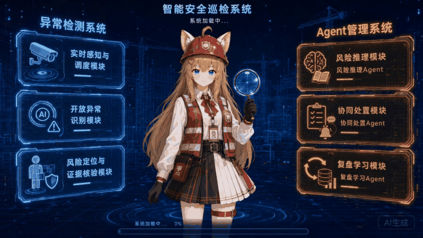

# SiteSafe-Sentinel 嘉然今天也在守护工地
An open-risk visual detection and multi-agent safety management platform for construction sites.

<p align="center">
  <a href="./combine/ZNT/video/%E5%80%99%E6%9C%BA%E5%8A%A8%E7%94%BB.mp4" title="点击观看原始高清视频">
    
  </a>
</p>

<p align="center"><em>点击动画可查看原始高清视频</em></p>

# 工地安全智能检测系统


---

## 怎么打开（PC 管理后台）

### 独立桌面版（推荐）

构建或交付后直接双击 `combine/ZNT/desktop-dist/SiteSafe-Sentinel.exe`。系统会在独立 Windows 窗口中打开，不显示浏览器地址栏，并自动启动业务后台与检测桥。关闭主窗口后，本次由桌面程序启动的后台进程会一并退出。

桌面端运行模式和模型路径由 `combine/ZNT/desktop-settings.json` 配置；模型权重仍采用外置路径，便于不同设备按显卡能力安装或更换。构建方法见 `combine/ZNT/desktop/README.md`。

### 兼容启动方式

根目录启动文件：

### `start-platform.bat`

1. 双击 `start-platform.bat`  
2. 选择检测模式后回车：  
   - **1 演示 Mock**：无需 GPU/API（先体验用这个）  
   - **2 本地离线**：YOLO 初筛 + 本地 Qwen + 本地 SAM3（推荐）  
   - **3 标准检测**：YOLO 初筛 + Qwen 云端 API + 本地 SAM3/CLIP  
3. **不要关闭**弹出的黑色窗口  
4. 浏览器打开 http://localhost:5173  
5. 登录选「管理员」，密码随便填  

体验检测：菜单 **「实时检测」** → 点测试图片 → **开始检测**

比赛展示版默认把包内预编辑的八张案例、风险点、检测框和掩码与真实接口数据合并显示；这不会伪造数据库事件。正式生产前如需仅显示实时数据，构建前设置 `VITE_ENABLE_PRESENTATION_ASSETS=false`。

### 模式 2/3 配置（本机 / 打包给别人）

1. **Python 环境**  
   - Demo展示随包提供 `python-runtime\python.exe` 和基础依赖，可直接使用  
   - Offline/Cloud真实检测使用另建的 `env\Scripts\python.exe`，启动脚本会优先选择完整环境  
2. **当前本机权重**：  
   - YOLO：`..\yolo_site_workspace_portable\weights\`  
   - Qwen：`E:\model\`  
   - SAM3：`E:\SAM3_MAIN\`  
   - CLIP：`C:\Users\SYS03\.cache\clip\ViT-L-14.pt`  
3. **密钥**：编辑 `detectmodel/Site_Safety_OpenRisk/.env`  
   - 模式 2 使用 `LOCAL_QWEN_*`，启动脚本会按需启动本地 Qwen  
   - 模式 3 填 `DASHSCOPE_API_KEY`  

依赖清单集中在 `requirements/` 目录。

---

## 三端怎么用

| 端 | 目录 | 能否用 | 使用方式 |
|----|------|--------|----------|
| **PC 管理后台** | `pc-admin/` | ✅ 主入口 | 双击 `start-platform.bat` → http://localhost:5173 |
| **门口大屏** | `big-screen/` | ✅ | 另开终端：`cd big-screen && npm install && npm run dev` → http://localhost:5174 |
| **安全员移动端** | `mobile/` | ✅ | `cd mobile && npm install && npm run dev` → http://localhost:5175 |

移动端说明见 `mobile/README.md`。PC 与移动端当前均为 Mock 数据可独立浏览；真实检测走 PC「实时检测」+ 检测桥接。

---

## 目录结构

```
ZNT/
├── start-platform.bat              ← 只双击这一个
├── start-local-qwen.bat            ← 本地Qwen服务（模式2自动调用）
├── Outcomes/                       ← 评测与成果图
├── example/                        ← 测试图片
├── JR/                             ← 队形象素材
├── requirements/                   ← Python 依赖清单
├── detectmodel/
│   └── Site_Safety_OpenRisk/       ← 检测算法与桥接
├── pc-admin/                       ← PC 管理后台
├── big-screen/                     ← 可视化大屏
├── mobile/                         ← 安全员移动端 H5
└── docs/
```

## 检测代码位置

| 内容 | 路径 |
|------|------|
| 算法包 | `detectmodel/Site_Safety_OpenRisk/` |
| 桥接服务 | 同目录 `detect_bridge.py`（端口 8810） |
| 云端配置 | `configs/qwen_visual.yaml` |
| 本地配置 | `configs/qwen_local_zero_cost.yaml` |
| 演示配置 | `configs/default.yaml` |
| 成果文档 | `Outcomes/` |

## 文档

1. [启动运行说明书](./docs/启动运行说明书.md)  
2. [对接指南](./docs/对接指南.md)  

## License / 授权说明

本项目为**源码可见的专有软件，并非开源软件**。版权归 SiteSafe-Sentinel 项目作者及依法享有权利的贡献者所有。

获得私有仓库访问权限，仅代表可以为非商业评估、比赛评审或内部测试查看和运行项目；未经著作权人事先书面许可，不得公开、再分发、商用、用于生产部署、训练模型、开发竞品或删除作者信息。

完整条款见 [LICENSE](./LICENSE)。第三方软件、模型、数据、字体、图片、角色素材和商标仍适用各自权利人的许可，本项目不对其主张独占权利。
