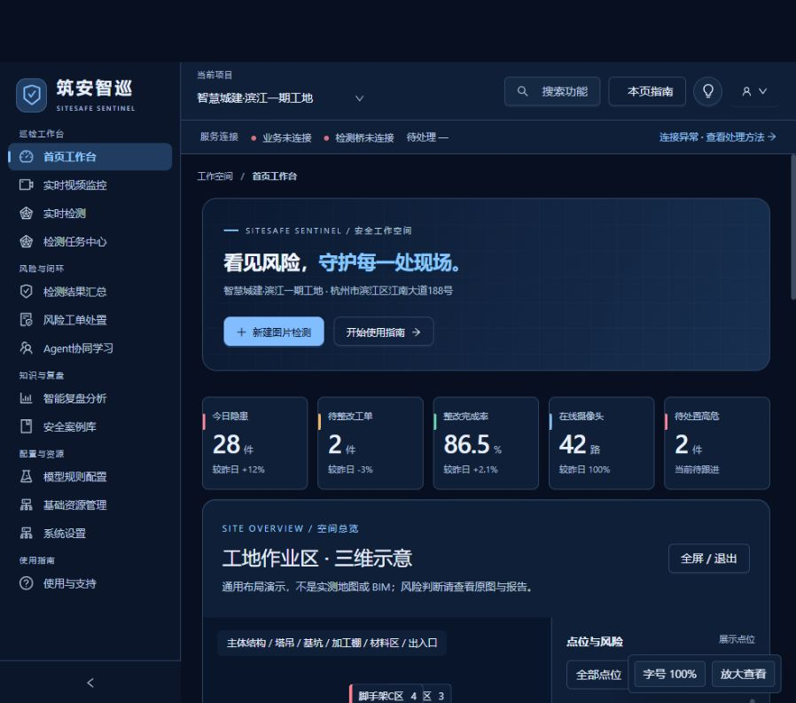
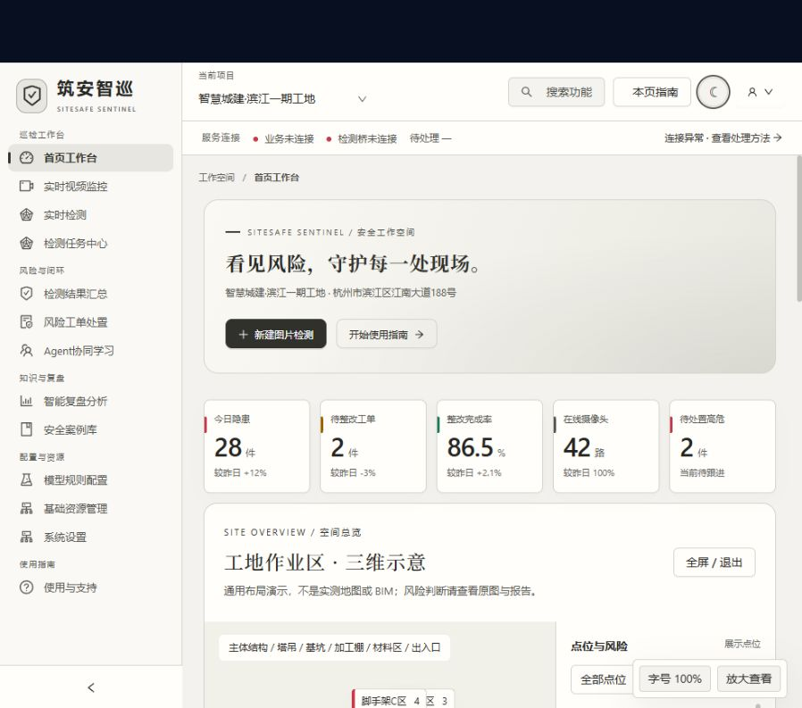

# 双主题设计与验证 · 2026-09-27

本轮更新 PC 管理工作台与桌面窗口共用的前端。未改大屏和移动端独立应用，未发布新 EXE。

## 深蓝工业

深海蓝背景、层次分明的钢蓝卡片、冷蓝操作高亮与首页蓝图网格。侧栏不抢主视野；三维场景同步使用蓝灰工业材质。首次无配色偏好时默认使用本主题，已有选择继续保留。

## 黑白水墨

纸白底色、墨黑操作按钮、灰阶图表、低对比墨色背景晕染；首页与空间总览标题使用系统宋体/衬线字体，业务表格保持易读的无衬线字体。三维建筑采用中性灰阶材质。

## 交互与信息保护

- 右上角主题按钮，或「系统设置 → 工作台与展示 → 主题配色」切换，自动保存。
- 登录页、首页、侧栏、控件、图表、三维场景同步变化。
- 风险红橙黄、成功绿等状态保留语义颜色，不强制黑白化。
- 不对现场图片、掩码和视频使用灰度滤镜，避免损失证据信息。
- 既有八个案例与模型链路不改变。

## 验证

33 项前端自动测试通过，包括两套主题关键文字/背景 4.5:1 对比度、主题令牌一致性、灰阶色板与冷蓝色板检查。生产构建成功；浏览器实际切换两套主题并截图，未发现控制台错误。没有重新调用模型。
