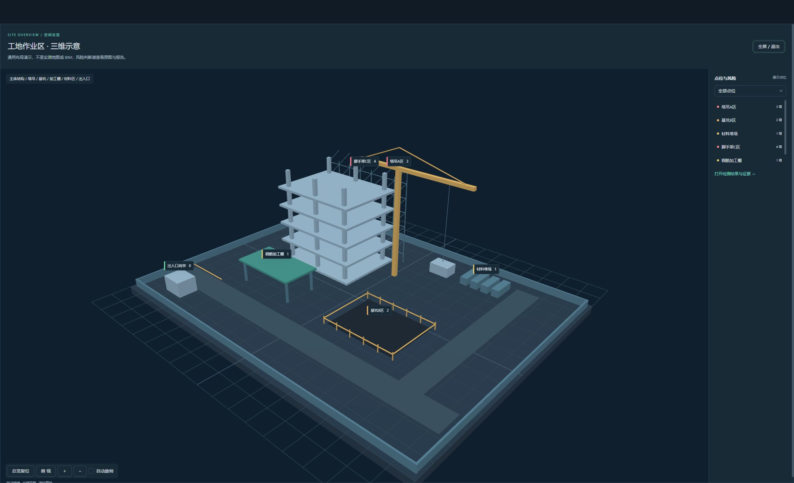

# 筑安智巡 · SiteSafe-Sentinel
## 面向开放施工风险的多模态安全监管与人机协同平台
### 当前源码功能报告 · 2026-09-27

> 本报告对应本轮源码更新；公开安装包仍为 v1.4.2，尚未包含本轮功能。三维图为示意布局，页面截图来自隔离 Mock 前端，不是新增现场检测结果。

## 1. 项目定位与使用边界

平台将图片、视频初筛和定期全图检查连接到开放风险发现、辅助定位、人工复核与工单处置。核心贡献在于可操作的数据契约、模型编排、证据保留和业务闭环；不把调用预训练模型表述为自研基础模型，也不把界面回归等同于识别精度提升。

## 2. 当前处理架构

`图片直接输入 / 实时初筛 / 定期检查 → Qwen 视觉观察与候选 → RiskSpec 编译 → SAM3 辅助定位与程序证据处理 → 风险报告和规范引用快照 → 人工复核 → 工单处置 → 复盘建议与审批`

| 环节 | 工具与职责 | 输出与边界 |
|---|---|---|
| 实时入口 | YOLO、抽帧与调度代码 | 初筛触发与区域提示；不能保证发现所有未训练风险 |
| 开放识别 | 本地或云端 Qwen | 可见事实、候选异常、疑点；不等于人工确认 |
| 结构化编译 | Python 与 RiskSpec | 将语义转换为定位任务与一致字段 |
| 辅助定位 | SAM3，可选 CLIP | 掩码、框和参考语义；无掩码不自动否定异常描述 |
| 规范关联 | 文档解析、检索和来源快照 | 保存出处、版本、页码等已有字段；无依据明确提示 |
| 业务处理 | 风险推理、协同处置、复盘学习三个 Agent | 风险建议、工单、复盘建议；保留人工决策和审批 |
| 管理界面 | Vue、Ant Design Vue、ECharts、Three.js | 同一工作台查看任务、证据、处置及配置 |

没有将“多尺度语义投影器”“视觉 Token 压缩训练”列为当前贡献；CLIP 是可选辅助，不是本系统的必经决策主干。

## 3. 本轮新增功能

### 工地三维总览

本地程序生成主体楼层、脚手架、塔吊、基坑边栏、材料区、加工棚和出入口。支持拖动旋转、右键平移、滚轮缩放、俯视、总览复位、自动旋转与全屏。

已配置的示例区域使用明确的示意锚点，并可通过点位详情进入关联摄像头。未知区域和真实业务点位不擅自投影到示意模型；摄像头入口与原二维点位仍保留。三维场景不推导真实坐标、距离或危险关系。

渲染使用本地 Three.js，无地图密钥与在线模型资源；离开页面释放几何体、材质和渲染器。不可渲染时仍可使用点位列表。

### 阅读与放大

右下角和系统设置均可调整字体 100%–200%，自动保存。查看模式支持画面 100%–400% 缩放、平移、Esc 退出；查看期间锁定原页面交互，避免误操作。字体设置不改变照片或掩码坐标。

### 图像与规范对照

真实结果卡片提供“图像与规范证据”窗口：左侧为当前记录图像，右侧为已保存引用。保留版本、效力状态、页序、文本、来源和 SHA256 等字段；不重新检索，不伪造旧记录的时间。关联风险字段只在原记录存在时显示。

### 可靠性修补

- 用户或项目缓存损坏时回退为空值，避免 JSON 解析导致启动失败。
- 关于页版本读取 package.json，不再硬编码旧版本。
- 视频轮播只显示实际传入的定位框，不再生成固定坐标的虚假框。
- 全屏时下拉控件随全屏容器显示。

## 4. 八个关键案例的展示策略

已有八张原图、异常描述、检测框、掩码与报告素材不删除，不重新生成。展示案例与真实记录保持来源区分；这些案例用于演示功能，不是随机测试集，不能用八例结果宣称全场景准确率。

## 5. 验证范围

本轮前端自动测试 32 项通过，生产构建通过；实际浏览器已检查场景渲染、俯视、明暗主题、点位选择与全屏。没有重新运行 YOLO、Qwen、SAM3 或公开数据集，也没有新增模型精度结论。

## 6. 尚需独立交付的内容

- 真实工地三维布局的导入、人工坐标标定及持久化；
- 历史检测全量归档迁移、旧知识库升级时的差异合并；
- 面向新设备的完整安装包回归和发布；
- 现场试点、准确率与误报率的独立验证。

## 7. 推荐演示顺序

首页三维总览 → 点位对应摄像头 → 八个关键案例 → 真实记录的图像与规范对照 → 人工复核与工单 → Agent 协同复盘 → 模型部署及连接诊断。

讲解时明确“示意布局”“预设展示”“真实检测”“人工结论”四种信息，不把展示数据说成实时现场发现。
